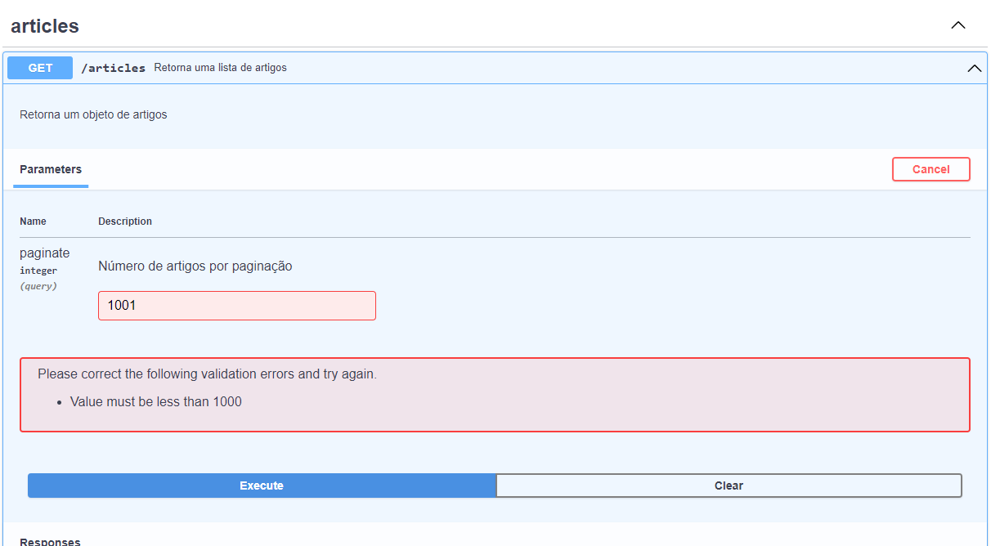
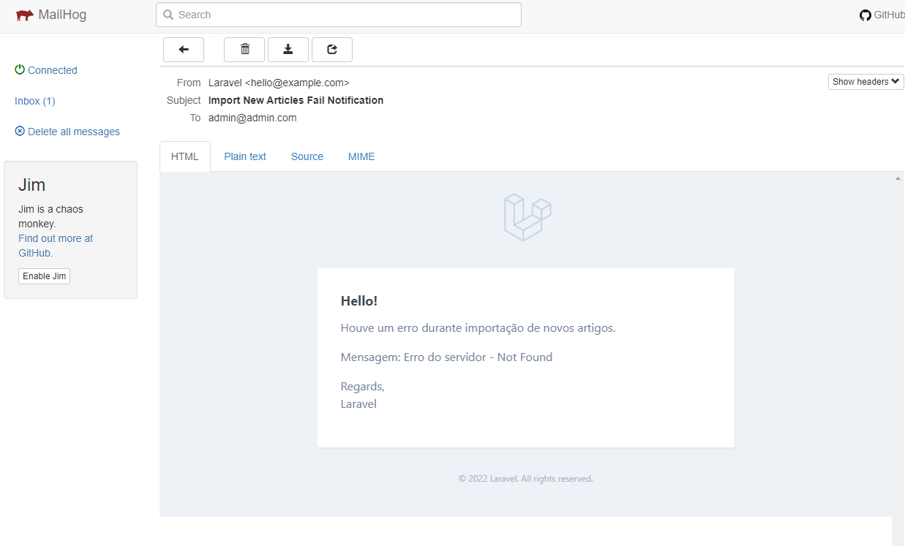

<h1 align="center">
    Space Fligh News API
</h1>

>  This is a challenge by [Coodesh](https://coodesh.com/)

## :boat: Sobre o projeto

Nesse projeto foi desenvolvida uma API para disponibilização de dados de artigos consumidos na API [Space Flight News](https://api.spaceflightnewsapi.net/documentation). Primeiramente implementou-se um script para importação de todos artigos disponíveis na API, e depois outro para importação diária de novos artigos publicados. Também foi implementado um sistema de alerta por e-mail para situações de ocorrência de falhas nas importações. 

Mais detalhes sobre o sistema estão descritos nos próximos tópicos.

## :hammer: Tecnologias:
- **[PHP 8.1](https://www.php.net)**
- **[Laravel](https://laravel.com/)**
- **[MySQL](https://www.mysql.com/)**
- **[MailHog](https://github.com/mailhog/MailHog)**
- **[Swagger-PHP](https://zircote.github.io/swagger-php/)**
- **[PHPUnit](https://phpunit.de)**

## :computer: Features

### Articles CRUD

Deve ser possível adicionar, visualizar, editar e remover registros referente a Artigos (Articles).
<h4 align="center">
    
</h4>

Na listagem de artigos também foi implementado um parâmetro chamado "paginate", pois para evitar requisições pesadas foi definido uma paginação padrão de 300 artigos por requisição. Mas o usuário da API pode alterar esse valor até o limite de 1000 artigos. Acima disso, a API recusa a requisição.
<h4 align="center">
    
</h4>

### Importação diária de artigos
Utilizando o recurso de Task Scheduling do Laravel, foi possível implementar uma rotina de importação de novos artigos. Para que ela funcione no servidor, basta adicionar o seguinte comando no cron do servidor:
```
* * * * * cd /caminho-ate-o-projeto && php artisan schedule:run >> /dev/null 2>&1
```

O horário da importação foi implementado em uma variável de ambiente no arquivo .ENV do projeto. Dessa forma, é possível alterar o horário padrão de 09 horas para outro sem a necessidade de alteração do código do sistema.
```
.env

IMPORT_TIME=09:00
```

### Sistema de alerta de falhas na importação
Na ocorrência de alguma falha nas importações, o sistema irá disparar uma mensagem para e-mail definido na variável de ambiente APP_ADMIN_MAIL. Para fins de testes em ambiente de desenvolvimento, foi quebrado temporiamente a URL da API, e utilizado um e-mail fictício chamado "admin@admin.com" para visualização da mensagem no serviço MAILHOG, conforme imagem a seguir:
<h4 align="center">
    
</h4>

