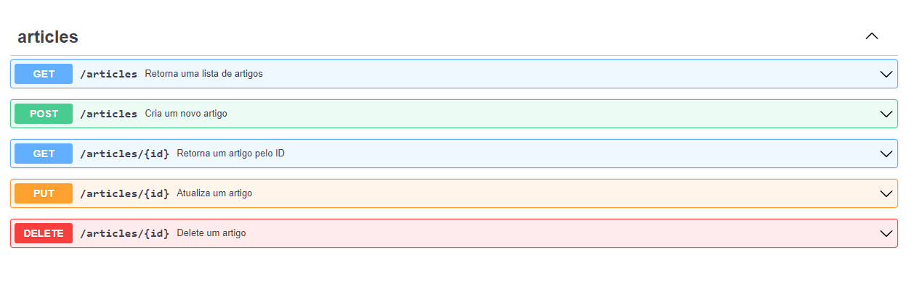

<h1 align="center">
    Transparência de Atos Jurídicos API
</h1>

>  This is a challenge by [Coodesh](https://coodesh.com/)

## :boat: Sobre o projeto

Nesse projeto foi desenvolvida uma API para disponibilização de dados de artigos consumidos na API [Space Flight News](https://api.spaceflightnewsapi.net/documentation). Primeiramente implementou-se um script para importação de todos artigos disponíveis na API, e depois outro para importação diária de novos artigos publicados. Também foi implementado um sistema de alerta por e-mail para situações de ocorrência de falhas nas importações. 

Mais detalhes sobre o sistema estão descritos nos próximos tópicos.

## :hammer: Tecnologias:
- **[PHP 8.1](https://www.php.net)**
- **[Laravel](https://laravel.com/)**
- **[MySQL](https://www.mysql.com/)**
- **[MailHog](https://github.com/mailhog/MailHog)**
- **[Swagger-PHP](https://zircote.github.io/swagger-php/)**
- **[PHPUnit](https://phpunit.de)**

## :computer: Features

### Articles CRUD

Deve ser possível adicionar, visualizar, editar e remover registros referente a Artigos (Articles).

<h4 align="center">
    
</h4>

