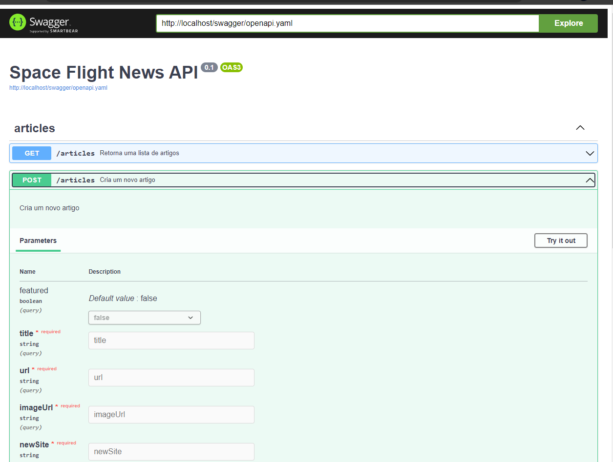
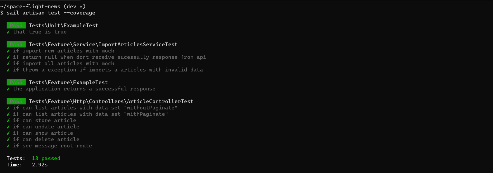
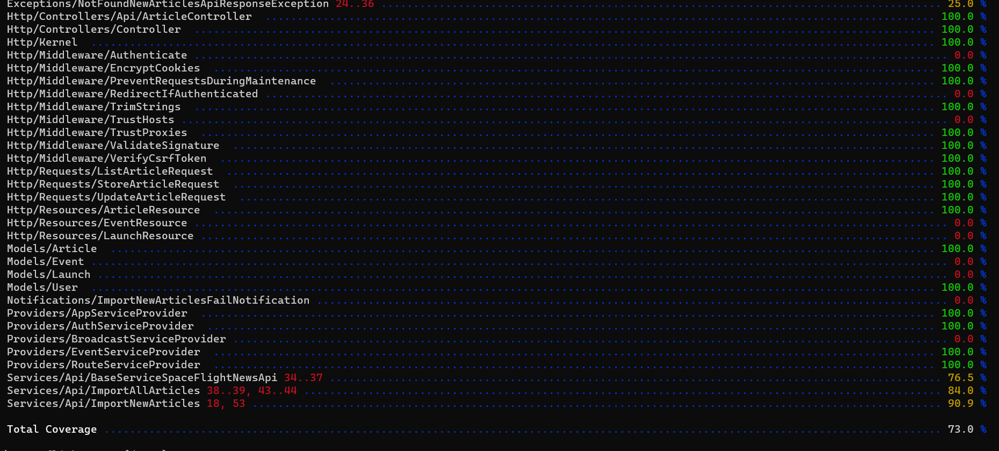

<h1 align="center">
    Space Flight News API
</h1>

>  This is a challenge by [Coodesh](https://coodesh.com/)

## :boat: Sobre o projeto

Nesse projeto foi desenvolvida uma API para disponibilização de dados de artigos consumidos na API [Space Flight News](https://api.spaceflightnewsapi.net/documentation). Primeiramente implementou-se um script para importação de todos artigos disponíveis na API, e depois outro para importação diária de novos artigos publicados. Também foi implementado um sistema de alerta por e-mail para situações de ocorrência de falhas nas importações. 

Mais detalhes sobre o sistema estão descritos nos próximos tópicos.

## :hammer: Tecnologias:
- **[PHP 8.1](https://www.php.net)**
- **[Laravel](https://laravel.com/)**
- **[MySQL](https://www.mysql.com/)**
- **[MailHog](https://github.com/mailhog/MailHog)**
- **[Swagger-PHP](https://zircote.github.io/swagger-php/)**
- **[PHPUnit](https://phpunit.de)**

## :rocket: Como rodar esse projeto
Primeiramente, clone este repositório aonde você costuma desenvolver seus projetos:
```
```

## :computer: Features

### Articles CRUD

Deve ser possível adicionar, visualizar, editar e remover registros referente a Artigos (Articles).
<h4 align="center">
    
</h4>

Na listagem de artigos também foi implementado um parâmetro chamado "paginate", pois para evitar requisições pesadas foi definido uma paginação padrão de 300 artigos por requisição. Mas o usuário da API pode alterar esse valor até o limite de 1000 artigos. Acima disso, a API recusa a requisição.
<h4 align="center">
    
</h4>

### Importação diária de artigos
Utilizando o recurso de Task Scheduling do Laravel, foi possível implementar uma rotina de importação de novos artigos. Para que ela funcione no servidor, basta adicionar o seguinte comando no cron do servidor:
```
* * * * * cd /caminho-ate-o-projeto && php artisan schedule:run >> /dev/null 2>&1
```

O horário da importação foi implementado em uma variável de ambiente no arquivo .ENV do projeto. Dessa forma, é possível alterar o horário padrão de 09 horas para outro sem a necessidade de alteração do código do sistema.
```
.env

IMPORT_TIME=09:00
```

### Sistema de alerta de falhas na importação
Na ocorrência de alguma falha nas importações, o sistema irá disparar uma mensagem para e-mail definido na variável de ambiente APP_ADMIN_MAIL. Para fins de testes em ambiente de desenvolvimento, foi quebrado temporiamente a URL da API, e utilizado um e-mail fictício chamado "admin@admin.com" para visualização da mensagem no serviço MAILHOG, conforme imagem a seguir:
<h4 align="center">
    
</h4>

## :top: Informações adicionais e boas práticas
### Documentação da API com Open API 3.0 e Swagger
Esta API foi documentada seguindo os preceitos do Open API 3.0. Através do [Swagger-PHP](https://zircote.github.io/swagger-php/), foi possível gerar um arquivo yaml com todas as definições dos endpoints da API, e disponibilizado de forma visual através do caminho /swagger. Dessa forma é possível verificar todos endpoints e especificações dos possíveis parâmetros, além de testá-los. 
<h4 align="center">
    
</h4>

### API RESTFul (Nível 3 de maturidade no Modelo de Richardson) 

### Importação de todos artigos e desacoplamento
Foi identificado a necessidade de duas rotinas de importação de dados da api Space Fligth News. Dessa forma, foi criado duas classes, sendo a ImportNewArticles ImportAllArticles. Buscando desacoplamento com o uso de Orientação a Objetos, foi criado uma classe abstrata chamada BaseServiceSpaceFlightNewsApi, onde se encontra as rotinas de acesso a API e a varíavel de ambiente da URL base. Dessa forma, cria-se um cenário onde uma possível mudança na API torna-se fácil no código, sem a necessidade de ficar alterando diversos lugares.

### Coluna "api_id"
Foi identificado também um possível caso de conflito de id, uma vez que é possível inserir artigos por essa API, e também pela importação da API da Space Flight News. Então os artigos importados da API são armazenados com uma coluna "api_id" onde é salvo o id da API de origem. Essa coluna é utilizada para referência ao importar novos artigos, pois no caso desse artigo já tiver sido importado, ele é atualizado, conforme código abaixo.
```php
class ImportNewArticles extends BaseServiceSpaceFlightNewsApi
{
 . . .
 public function execute()
    {
        $result = $this->getJsonResult('articles');
        if ($result != null) {
            foreach ($result as $data) {
                $article = Article::updateOrCreate(['api_id' => $data['id']], [
                    'api_id' => $data['id'],
                    'featured' => $data['featured'],
                    'title' => $data['title'],
                    'url' => $data['url'],
                    'imageUrl' => $data['imageUrl'],
                    'newsSite' => $data['newsSite'],
                    'summary' => $data['summary'],
                    'publishedAt' => $data['publishedAt'],
                ]);
                
                if (!empty($data['launches']))
                    $article->launches()->upsert($data['launches'], ['id'], ['provider']);
                if (!empty($data['events']))
                    $article->events()->upsert($data['events'], ['id'], ['provider']);
            }
            return true;
        }

        return null;
    }
}

```

### Cobertura de testes
Com a presença de rotinas adicionais, foi identificado a necessidade de testar outras funcionalidades além daquelas relacionadas a disponibilização dos endpoints. Nesse projeto, foi implementado uma cobertura de testes de 80%, utilizando recursos do Laravel para dublê de testes, como o Http::fake() para simular respostas da API e testar possíveis cenários, até os excepcionais.
<h4 align="center">
    
</h4>
<h4 align="center">
    
</h4>


## :rocket: Como rodar esse projeto
Primeiramente, clone este repositório aonde você costuma desenvolver seus projetos:
```
